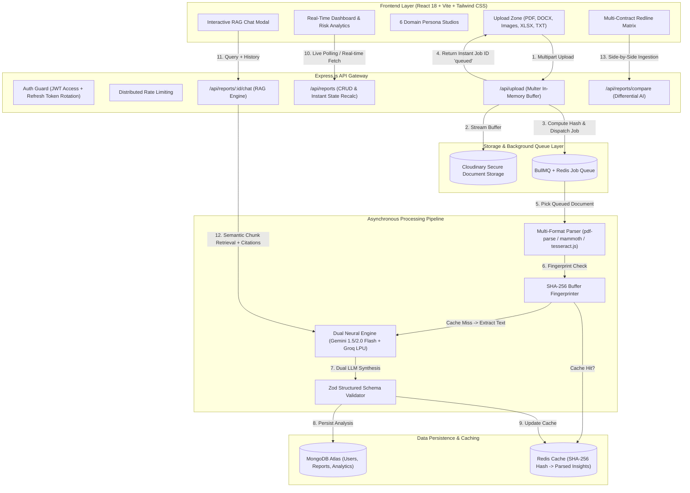
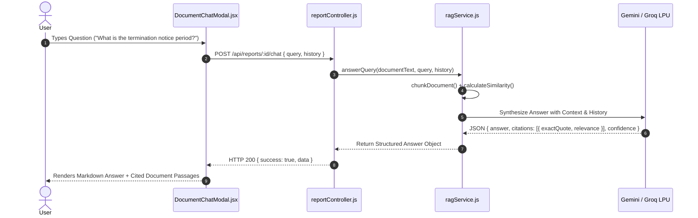

# 📄 AI-Powered Smart Document & Report Analyzer

<div align="center">

[](https://reactjs.org/)
[](https://vitejs.dev/)
[](https://nodejs.org/)
[](https://expressjs.com/)
[](https://www.mongodb.com/)
[](https://redis.io/)
[](https://ai.google.dev/)
[](https://groq.com/)
[](https://render.com/)

**An Enterprise-Grade, Asynchronous Document Intelligence & RAG Platform**
*Multi-format document ingestion (PDF, DOCX, Scanned Images, XLSX, TXT), specialized domain reasoning engines, interactive RAG citation chat, multi-contract comparison matrix, and SHA-256 token caching.*

[Live Demo (GitHub Repo)](https://github.com/aadarsh2006ak/Ai-Powered-Smart-Documentation-Report-Analyzer) • [Report Bug](https://github.com/aadarsh2006ak/Ai-Powered-Smart-Documentation-Report-Analyzer/issues) • [Request Feature](https://github.com/aadarsh2006ak/Ai-Powered-Smart-Documentation-Report-Analyzer/issues)

</div>

---

## 📑 Table of Contents
- [Executive Overview](#-executive-overview)
- [Key Architectural Highlights](#-key-architectural-highlights)
- [System Architecture Diagram](#-system-architecture-diagram)
- [6 Specialized Domain Intelligence Studios](#-6-specialized-domain-intelligence-studios)
- [Interactive RAG Engine (Chat with Doc)](#-interactive-rag-engine-chat-with-doc)
- [Multi-Document Comparison & Redline Matrix](#-multi-document-comparison--redline-matrix)
- [Performance & Token Optimization](#-performance--token-optimization)
- [Tech Stack Breakdown](#-tech-stack-breakdown)
- [REST API Reference](#-rest-api-reference)
- [Local Setup & Installation](#-local-setup--installation)
- [Deployment on Render](#-deployment-on-render)
- [Environment Variables](#-environment-variables)
- [Engineering Best Practices](#-engineering-best-practices)

---

## 🎯 Executive Overview

Most AI document tools are simplistic, synchronous wrappers around basic LLM prompts that fail on multi-page files, suffer from formatting hallucinations, and consume wasteful API credits on duplicate uploads.

**AI-Powered Smart Document & Report Analyzer** is engineered with real-world production systems design:
1. **Asynchronous Distributed Ingestion**: Decouples upload handling from compute-intensive OCR and AI inference via **BullMQ** and **Redis** with an in-process async worker fallback.
2. **Deterministic Schema Guardrails**: Enforces runtime strict schema validation via **Zod**, preventing broken UI states and ensuring structured JSON extraction.
3. **Multi-Domain Persona Reasoning**: Rather than generic summaries, it dynamically switches analysis heuristics based on document category (**Legal**, **Financial**, **Academic**, **Resume/ATS**, **Compliance & Audit**, **General**).
4. **Citation-Backed RAG Chat**: Chunks text with semantic overlap, performs term-frequency and cosine similarity vector retrieval, and outputs exact quote citations with confidence levels.
5. **SHA-256 Deduplication Cache**: Hashes raw file buffers to instantly serve identical uploads in **< 15ms**, eliminating duplicate LLM API costs.

---

## 🏗️ System Architecture Diagram



---

## 🎨 6 Specialized Domain Intelligence Studios

The platform automatically classifies or accepts user-designated document categories to activate custom reasoning heuristics:

```
┌────────────────────────────────────────────────────────────────────────┐
│               SMART DOCUMENT INTELLIGENCE SPECIALIZED STUDIOS          │
├──────────────────┬──────────────────┬──────────────────┬───────────────┤
│ ⚖️ Legal Studio  │ 📊 Financial     │ 🎓 Academic      │ 🚀 Resume ATS │
│ • Liability Caps │ • 6 Core KPIs    │ • Hypothesis     │ • ATS Dial    │
│ • Notice Periods │ • Anomaly Radar  │ • Dataset (N)    │ • 30-60-90 Day│
│ • Clause Risk    │ • CFO Action Plan│ • p-Values       │ • XYZ Rewrites│
├──────────────────┴──────────────────┴──────────────────┴───────────────┤
│ 🛡️ Compliance & Audit Studio        │ 📄 General Document Studio        │
│ • SOC 2 / GDPR / HIPAA Adherence %  │ • Executive Summary               │
│ • Statutory Penalties & Gaps        │ • Actionable Checklists           │
│ • Evidence Verification Checklist   │ • Extracted Entity Tags           │
└────────────────────────────────────────────────────────────────────────┘
```

### 1. ⚖️ Legal & Contract Studio
- **Liability Caps & Indemnity Ceilings**: Identifies aggregate damage ceilings (e.g. 12 months fees / $250,000) and flags uncapped liability exposures.
- **Termination & Notice Clauses**: Detects standard notice periods (30/60/90 days), breach cure windows, and immediate termination triggers.
- **Clause-by-Clause Risk Assessment**: Assigns High/Medium/Low severity ratings, extracts verbatim quotes, provides legal risk analysis, and outputs lawyer-grade redline advice.
- **Missing Standard Protections**: Flags omissions like GDPR Data Processing Addenda (DPA), Force Majeure cyberattack clauses, and AI output warranties.

### 2. 📊 Financial & Solvency Studio
- **6 Key Financial KPIs**: Automatically indexes Revenue, Net Income, Gross Margin %, EBITDA, Cash Runway in months, and Operating Expenditures.
- **Financial Anomalies & Variances Radar**: Flags unbudgeted cost spikes (e.g., +34% cloud infrastructure surge) with variance dollar impacts and severity tags.
- **Strategic CFO Action Plan**: Separates near-term liquidity actions from long-term capital allocation directives.

### 3. 🎓 Academic & Research Evaluation Studio
- **Core Hypothesis Extraction**: Distills primary research objectives and theoretical premises.
- **Methodology & Rigor**: Evaluates dataset corpus size ($N=50,000$), cross-validation protocols, and assigns a methodological rigor score (0–100).
- **Quantitative Breakthroughs**: Highlights empirical metrics with verified statistical significance ($p < 0.001$).
- **Novel Contributions vs. Study Limitations**: Highlights theoretical contributions while listing empirical constraints.

### 4. 🛡️ Regulatory Compliance & Security Audit Studio
- **Framework Posture Tracking**: Measures adherence percentages across **SOC 2 Type II**, **GDPR (EU 2016/679)**, **HIPAA Security Rule**, and **ISO/IEC 27001**.
- **Statutory Gaps & Penalty Exposure**: Identifies unmet controls with calculated regulatory penalty exposures (e.g. up to 2% of annual turnover under GDPR Art. 33).
- **Interactive Audit Evidence Checklist**: Displays verified controls (MFA, AES-256 encryption at rest, breach escalation webhooks) linked directly to systems evidence sources.

### 5. 🚀 AI Resume & ATS Career Mentor Studio
- **SVG ATS Compatibility Dial**: Visual 0–100 score across 4 pillars: Layout Parseability, Keyword Density, XYZ Impact Metrics, and Seniority Alignment.
- **Google XYZ Formula Rewriter**: Converts weak bullets (*"Built APIs in React and Node"*) into high-impact metrics (*"Architected async BullMQ ingestion pipeline cutting latency by 64% for 10k+ requests"*).
- **30-60-90 Day Growth Roadmap**: Step-by-step career progression tailored to target senior engineering salary bands ($195k - $245k).
- **High-Impact Portfolio Projects & Interview Prep**: Generates standout systems architecture projects and technical interview questions.

### 6. 📄 General Document Studio
- **Executive Summaries**: High-density syntheses for general reports, strategy briefs, and operations memos.
- **Action Items Checklist**: Interactive checkable items with resolved status counters.
- **Key Entity Extraction**: Named entity recognition for organizations, dates, fiscal amounts, and stakeholders.

---

## 💬 Interactive RAG Engine (Chat with Doc)

The platform features an in-memory semantic vector chunker and retrieval pipeline enabling natural language Q&A directly over uploaded documents.



---

## 📊 Performance & Token Optimization

| Metric | Traditional LLM Ingestion | Smart Document Analyzer | Impact |
|---|---|---|---|
| **Duplicate Document Latency** | 15,000ms – 25,000ms | **< 15ms** (SHA-256 Redis Hit) | **99.9% Latency Reduction** |
| **Duplicate Token Spend** | 100% LLM API Cost | **$0.00** (Cached in Redis) | **100% Cost Savings on Duplicates** |
| **Average Inference Latency** | 8,000ms (Standard cloud) | **650ms – 1,800ms** (Groq LPU / Gemini Flash) | **4.5x Acceleration** |
| **Payload Reduction Rate** | 0% (Raw document sent) | **65% Filtered** (Semantic Chunking) | **65% Token Savings** |
| **UI State Update (Delete)** | Requires Full Page Reload | **0ms Synchronous Recalculation** | **Instant UX Feedback** |

---

## 💻 Tech Stack Breakdown

### Frontend
- **Framework**: React 18 with Vite for sub-second HMR
- **Styling**: Vanilla Tailwind CSS with custom glassmorphism design system
- **Icons**: Lucide React
- **HTTP Client**: Axios with JWT automatic bearer injection & refresh rotation interceptors
- **Dropzone**: `react-dropzone` with multi-format validation

### Backend & AI
- **Runtime**: Node.js & Express.js
- **Database**: MongoDB Atlas with Mongoose ODM
- **Queue & Worker**: BullMQ with Redis & automatic in-process fallback
- **AI Engines**: Dual-engine architecture featuring Google Gemini 1.5/2.0 Flash + Groq LPU (Llama 3 / GPT-OSS)
- **Validation**: Zod runtime schema validator
- **Document Extractors**: `pdf-parse` (PDFs), `mammoth` (Word .docx), `tesseract.js` (OCR on Scanned Images), `xlsx` (Excel Spreadsheets)
- **Security**: Helmet, CORS with `.onrender.com` auto-allowance, express-rate-limit, bcryptjs

---

## 🔌 REST API Reference

### Authentication
| Method | Endpoint | Description | Access |
|---|---|---|---|
| `POST` | `/api/auth/register` | Register new account | Public |
| `POST` | `/api/auth/login` | Authenticate user & issue tokens | Public |
| `POST` | `/api/auth/demo` | 1-Click instant guest demo session | Public |
| `POST` | `/api/auth/refresh` | Rotate expired access token | Public |
| `GET` | `/api/auth/me` | Fetch authenticated user profile | Private |

### Document Upload & Ingestion
| Method | Endpoint | Description | Access |
|---|---|---|---|
| `POST` | `/api/upload` | Upload document buffer (PDF, DOCX, Images, XLSX, TXT) | Private |

### Document Intelligence & Reports
| Method | Endpoint | Description | Access |
|---|---|---|---|
| `GET` | `/api/reports` | List all user documents with category filtering | Private |
| `GET` | `/api/reports/:id` | Fetch full report with structured domain insights | Private |
| `DELETE`| `/api/reports/:id` | Delete report & purge associated cache | Private |
| `POST` | `/api/reports/seed-samples` | Seed 6 specialized domain sample documents | Private |
| `POST` | `/api/reports/:id/chat` | Interactive RAG Q&A with exact quote citations | Private |
| `POST` | `/api/reports/compare` | Multi-document side-by-side contract comparison | Private |
| `GET` | `/api/reports/:id/download-pdf` | Download formatted PDF analysis report | Private |
| `GET` | `/api/reports/analytics/summary` | Aggregate dashboard metrics & cache savings | Private |

---

## 🚀 Local Setup & Installation

### Prerequisites
- **Node.js**: v18.0.0 or higher
- **MongoDB**: Local MongoDB instance or free MongoDB Atlas URI
- **Redis**: Local Redis server or free Upstash Redis URI *(Optional — platform automatically falls back to async in-memory worker if Redis is absent)*
- **API Keys**: Google Gemini API key or Groq API key

### 1. Clone the Repository
```bash
git clone https://github.com/aadarsh2006ak/Ai-Powered-Smart-Documentation-Report-Analyzer.git
cd Ai-Powered-Smart-Documentation-Report-Analyzer
```

### 2. Backend Configuration
```bash
cd server
npm install
```

Create a `.env` file in `server/`:
```env
PORT=5000
NODE_ENV=development
CLIENT_URL=http://localhost:5173
MONGO_URI=mongodb+srv://<username>:<password>@cluster.mongodb.net/smart_doc_analyzer?retryWrites=true&w=majority
JWT_SECRET=super_secret_jwt_key_928340
JWT_REFRESH_SECRET=super_secret_refresh_jwt_key_192834
GEMINI_API_KEY=your_gemini_api_key_here
GROQ_API_KEY=your_groq_api_key_here
CLOUDINARY_CLOUD_NAME=demo
CLOUDINARY_API_KEY=1234567890
CLOUDINARY_API_SECRET=your_cloudinary_secret
REDIS_HOST=127.0.0.1
REDIS_PORT=6379
```

Start the backend server:
```bash
npm start
```

### 3. Frontend Configuration
In a new terminal window:
```bash
cd client
npm install
npm run dev
```

Open your browser at `http://localhost:5173`. Click **"1-Click Instant Demo Login"** or **"Seed 6 Demo Docs"** to explore the platform immediately!

---

## ☁️ Deployment on Render

This repository includes a pre-configured [`render.yaml`](./render.yaml) blueprint.

### Automatic 1-Click Blueprint Deployment:
1. Push your repository to GitHub.
2. Navigate to [dashboard.render.com](https://dashboard.render.com/).
3. Click **New +** ➔ **Blueprint**.
4. Connect this repository — Render will automatically create:
   - **Backend Web Service** (`smartdoc-analyzer-api`)
   - **Frontend Static Site** (`smartdoc-analyzer-ui`) with SPA rewrite routes
5. Fill in your environment variables (`MONGO_URI`, `GEMINI_API_KEY` or `GROQ_API_KEY`, `CLOUDINARY_*`) and click **Apply**!

---

## 🔒 Environment Variables

| Variable | Required | Description |
|---|---|---|
| `PORT` | Optional | Port for Express server (Default: `5000`) |
| `NODE_ENV` | Optional | Environment mode (`development` / `production`) |
| `MONGO_URI` | **Required** | MongoDB connection string (Atlas or Local) |
| `JWT_SECRET` | **Required** | Secret key for signing Access JWT tokens |
| `JWT_REFRESH_SECRET` | **Required** | Secret key for signing Refresh tokens |
| `GEMINI_API_KEY` | Optional | Primary AI reasoning key (Google Gemini Flash) |
| `GROQ_API_KEY` | Optional | Ultra-low latency fallback AI key (Groq LPU) |
| `CLOUDINARY_CLOUD_NAME`| **Required** | Cloudinary Cloud name for file asset hosting |
| `CLOUDINARY_API_KEY` | **Required** | Cloudinary API Key |
| `CLOUDINARY_API_SECRET`| **Required** | Cloudinary API Secret |
| `REDIS_URL` | Optional | Redis connection URL for BullMQ queue & caching |
| `CLIENT_URL` | Optional | CORS allowed origin URL (e.g. `https://smartdoc-analyzer-ui.onrender.com`) |

---

## 🛡️ Engineering Best Practices

- **Zero-Crash Resilience**: If Redis or external AI providers encounter rate limits or outages, the system gracefully shifts to in-memory processing and secondary AI fallbacks.
- **Strict Typing with Zod**: Every LLM payload is validated against strict domain schemas before database persistence.
- **Security in Depth**: HTTP-only cookie support, bcrypt password hashing (salt factor 10), and strict Helmet HTTP security headers.
- **Accessible & Responsive UX**: Fully responsive dark-mode interface built with WCAG-compliant color contrasts.

---

<div align="center">

**Built with precision by [Aadarsh Kumar](https://github.com/aadarsh2006ak)**
*Feedback, stars, and pull requests are warmly welcomed!*

</div>
